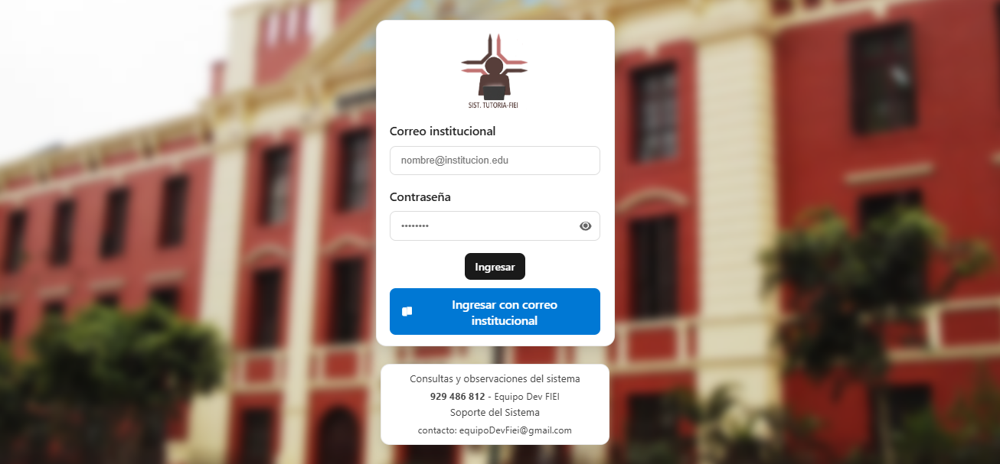
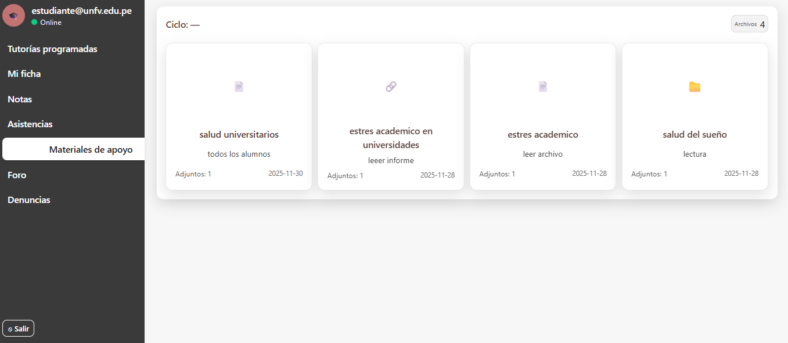
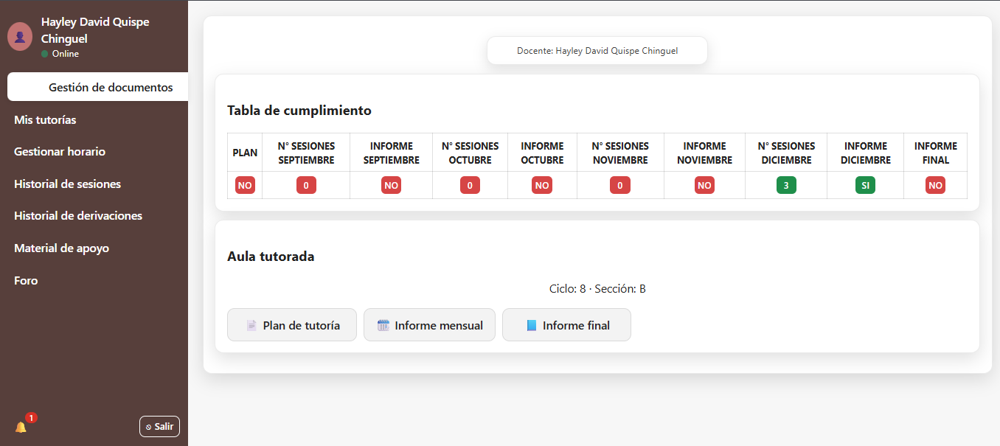

# Sistema de Gestión de Tutorías

## Contexto
Este proyecto es una plataforma web diseñada para la gestión integral de tutorías académicas. Facilita la interacción entre estudiantes, docentes y la oficina administrativa, asegurando un flujo de información eficiente y seguro mediante el uso de correos institucionales.

## Necesidad
Este proyecto nace de la necesidad de optimizar el seguimiento académico y tambien de digitalizar y centralizar estos procesos, resolviendo problemas como:
- La dispersión de la información en procesos manuales.
- La dificultad para realizar un seguimiento efectivo de las sesiones de tutoría.
- La necesidad de un canal formal y seguro para la gestión de documentos y denuncias.
- La automatización en la asignación de docentes y validación de accesos.

## Vistas del Sistema

### Inicio de Sesión
> Espacio para captura de pantalla del Login

### Panel del Estudiante
> Espacio para captura de pantalla del Dashboard del Estudiante

### Panel del Docente
> Espacio para captura de pantalla del Dashboard del Docente


### Panel Administrativo (Oficina)
> Espacio para captura de pantalla del Dashboard de la Oficina

## Tecnologías Utilizadas
- **Frontend:** React + Vite
- **Backend / Servicios:** Firebase (Authentication, Firestore, Storage) y Supabase
- **Lenguaje:** JavaScript (ES6+)
- **Estilos:** CSS3

## Configuración e Instalación

1. **Clonar el repositorio:**
   ```bash
   git clone <url-del-repositorio>
   cd tutorias
   ```

2. **Instalar dependencias:**
   ```bash
   npm install
   ```

3. **Configurar variables de entorno:**
   Crea un archivo `.env` en la raíz del proyecto basándote en `.env.example` y completa las credenciales de Firebase y Supabase:
   ```env
   VITE_FIREBASE_API_KEY=...
   VITE_FIREBASE_auth_DOMAIN=...
   VITE_FIREBASE_PROJECT_ID=...
   # ... resto de variables
   ```

4. **Ejecutar en desarrollo:**
   ```bash
   npm run dev
   ```

## Estructura del Proyecto
- `/src/auth`: Manejo de autenticación y seguridad.
- `/src/docente`: Módulos para docentes (historial, documentos, foro).
- `/src/estudiante`: Módulos para estudiantes (denuncias, dashboard).
- `/src/oficina`: Gestión administrativa y asignaciones.
- `/src/services`: Lógica de conexión con Firebase/Supabase.
